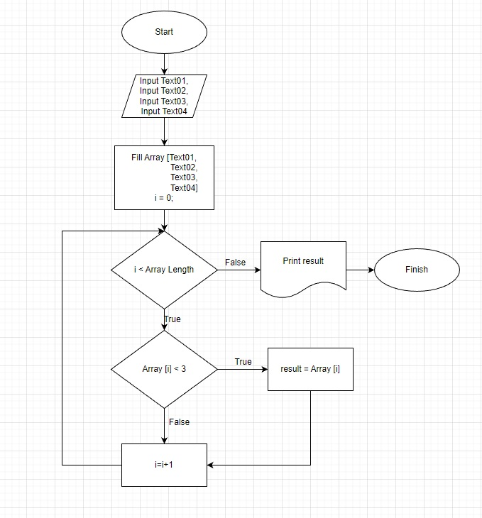
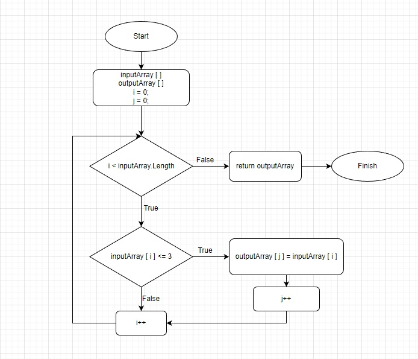

# Hello!
Here is my test work for completeing 1st quarter of my education.
I have a task:
* Write a program which produce new array from existing array with conditions that elements of new array are equal or less then a three symbols.

# How to solve Task:
1. Get Input Array.
2. Start to compare the Length of every element to less or equal to 3.
3. If condition in Step 2 is True we add that element to Output Array.
4. If condition in Step 2 is  False we continue to compare next element of Input Array.
5. Steps 2..4 loop while "i" (index of Input Array) smaller then Input Array Length. Primary value of index is 0.
6. Returning Output Array.
